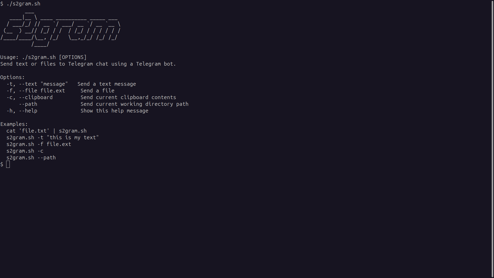

# s2gram
**s2gram.sh is a Bash script that facilitates sending text messages or files to a Telegram chat using a Telegram bot.**

## ***Requirements***

- curl /bin
- Telegram chat ID [CHATID](CHATID.md)
- Telegram bot API token [AUTHTOKEN](AUTHTOKEN.md)
## ***Installation***

 - cd to **s2gram** directory.
 - make executable: `sudo chmod +x ./s2gram.sh`
 - add in /bin: `sudo cp s2gram.sh /bin/s2gram` OR `sudo cp s2gram /usr/bin/s2gram` 
 - you will be able to access and run the s2gram with simple `s2gram --help` command.

## ***Download s2gram***

You can download the latest version of s2gram by cloning the GitHub repository.

    git clone https://github.com/ShingareOm/s2gram.git

## ***Features***
- Send Messages
    Send text messages directly to Telegram.
    Send files as documents to Telegram.

- Clipboard Integration
    Fetch and send the current contents of the clipboard.

- Path Information
    Retrieve and send the current working directory path.

- Piping
    You can use this tool using piping as well, to send some data using stdin pipe

- Help and Usage
    Provides a comprehensive help message outlining available options and examples.

## **Advanced Usage**

<pre><code>
Author: Om Shingare (<a href="https://in.linkedin.com/in/shingareom">Om Shingare</a>)

Usage: ./s2gram.sh [OPTIONS]
Send text or files to Telegram chat using a Telegram bot.

Options:
  -t, --text "message"    Send a text message
  -f, --file file.ext     Send a file
  -c, --clipboard         Send current clipboard contents
      --path              Send current working directory path
  -h, --help              Show this help message

Examples:
  cat 'file.txt' | s2gram.sh
  s2gram.sh -t \"this is my text\"
  s2gram.sh -f file.ext
  s2gram.sh -c
  s2gram.sh --path

</code></pre>

## **Legal disclaimer**

    Usage of s2gram for attacking targets without prior mutual consent is illegal.
    It is the end user's responsibility to obey all applicable local,state and federal laws. 
    Developer assume no liability and is not responsible for any misuse or damage caused by this program.